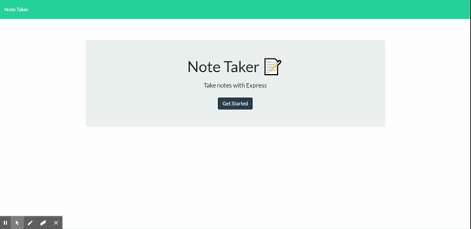

# Express - Note Taker

## Description

An application that can be used to write, save, and delete notes. This application uses an express backend and save and retrieve note data from a file.

https://git.heroku.com/notetaker-mubin.git

## Features

-Utilizes NodeJS and Express
-Deployed on Heroku
-You are able to save a retireve data based on the unqiue Id from the server. 